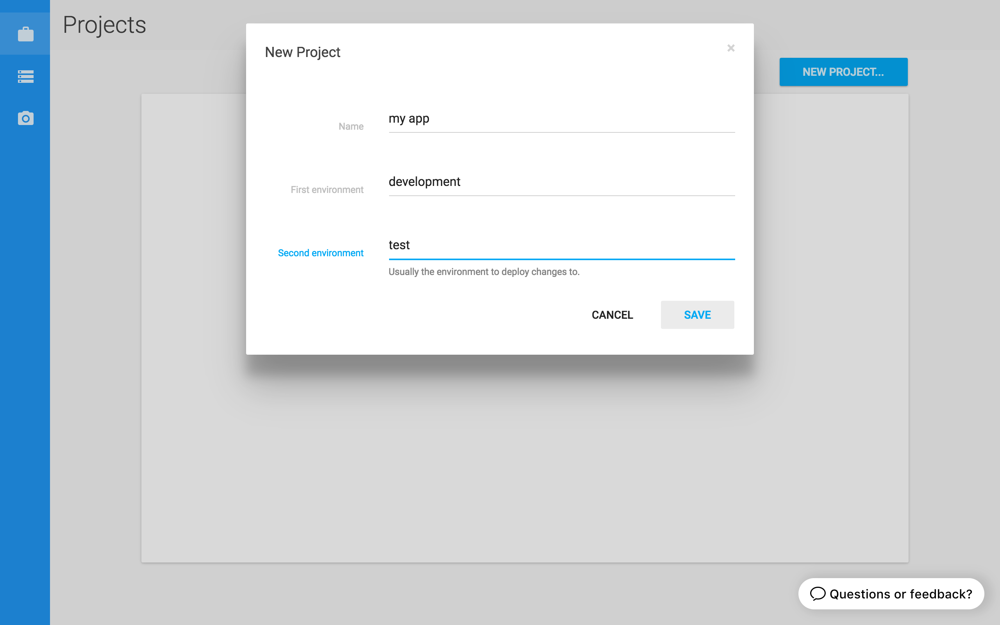
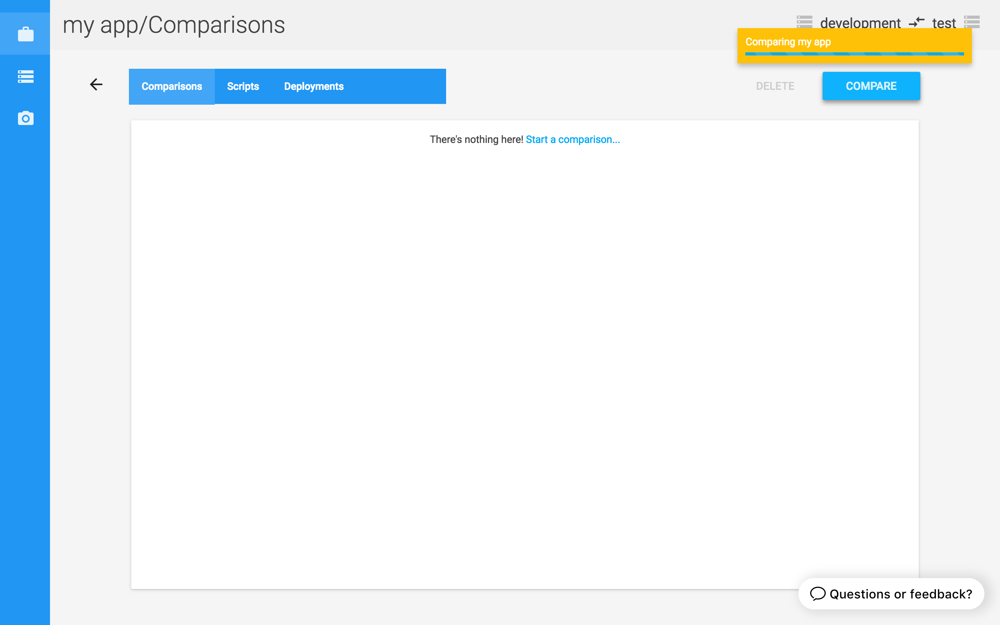
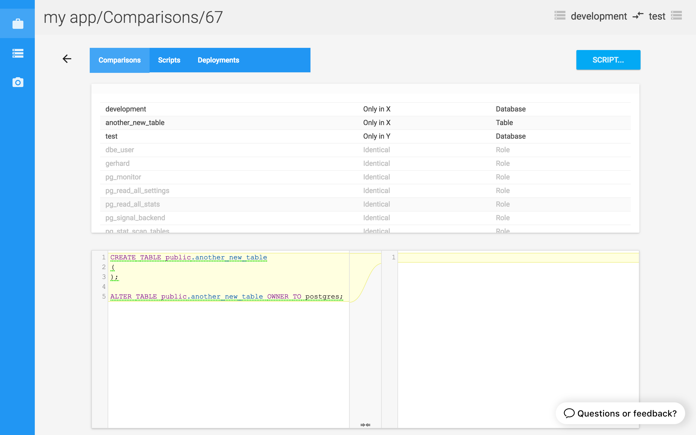
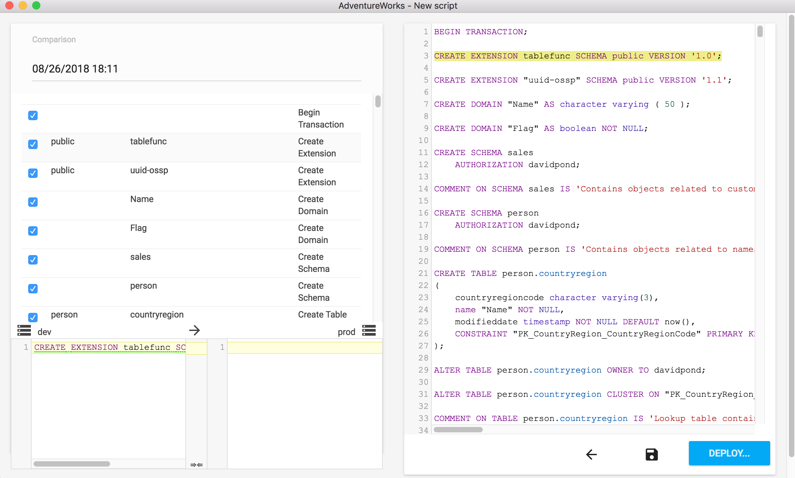
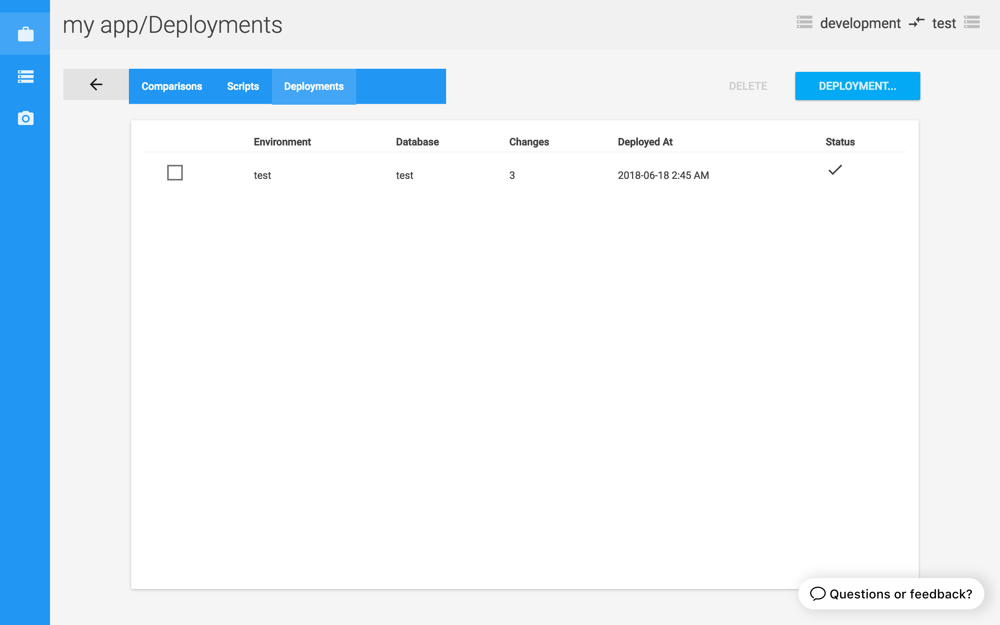

#### 1. Set up your environments

Environments represent the different databases that you need Postgres Compare to talk to. Add an environment by clicking on the "Environments" tab, followed by the "New Environment" button. Once you've filled in the connection details and tested that Postgres Compare can connect to the database, click "Save".

#### 2. Create a project

A project matches together 2 environments that are to be compared. Create a project by clicking on the "Projects" tab, followed by the "New Project" button. Choose the environments to be compared, give the project a name and click "Save". The project appears in the projects list.

#### 3. Run a comparison

Click on a project from the projects list to view the project details page. The project details page allows you to run and view comparisons, create scripts and deploy changes.

Start a new comparison by clicking the "Compare" button on the comparisons tab.

When the comparison is finished, click on the notification to view the result and explore any differences.

#### 4. Create an update script

The scripts tab stores generated SQL scripts that can be used to update a database with new, altered or dropped objects. When viewing a comparison, click the "Script..." button to create a new script, include the changes you want and click "Save".

#### 5. Deploy the changes

A project's deployments tab records the result of running a script via Postgres Compare. While viewing a script, click the "Deploy...." button to deploy the changes.

